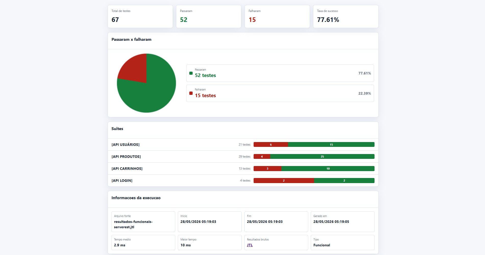

# Testes Funcionais da API ServeRest com JMeter e Taurus


[](https://github.com/pedjnr/serverest-api-jmeter-functional-tests/actions/workflows/pages.yml)

Projeto de automação de testes funcionais para a API ServeRest, usando Apache JMeter como ferramenta de execução, Taurus como orquestrador e GitHub Actions para publicar um relatório HTML no GitHub Pages.

O objetivo é apresentar uma suíte funcional clara, rastreável e fácil de visualizar, com foco em cenários que passam ou falham. A pipeline sobe a API ServeRest localmente no runner antes da execução, mantendo os testes independentes do ambiente local da máquina.

## Destaques

- 67 casos funcionais automatizados.
- 25 requisitos e regras de negócio rastreados.
- Classificação por prioridade, tipo, smoke e regressão.
- Relatório HTML funcional customizado.
- Resumo executivo com total de testes, aprovados, reprovados e taxa de sucesso.
- Agrupamento por suítes no estilo de relatório funcional.
- API ServeRest iniciada automaticamente durante a execução no GitHub Actions.
- Publicação automatizada pelo GitHub Actions e GitHub Pages.

## Relatório

[https://pedjnr.github.io/serverest-api-jmeter-functional-tests/](https://pedjnr.github.io/serverest-api-jmeter-functional-tests/)



## Resultado Registrado

| Métrica | Valor |
| --- | ---: |
| Total de testes | 67 |
| Testes aprovados | 52 |
| Testes reprovados | 15 |
| Taxa de sucesso | 77.61% |
| Requisitos rastreados | 25 |

## Cobertura por Suíte

| Suíte | Total | Aprovados | Reprovados |
| --- | ---: | ---: | ---: |
| `[API LOGIN]` | 4 | 2 | 2 |
| `[API USUÁRIOS]` | 21 | 15 | 6 |
| `[API PRODUTOS]` | 29 | 25 | 4 |
| `[API CARRINHOS]` | 13 | 10 | 3 |

## Documentação

- [Plano de testes](Documenta%C3%A7%C3%A3o%20de%20testes/01-plano-de-testes.md)
- [Estratégia de testes](Documenta%C3%A7%C3%A3o%20de%20testes/02-estrategia-de-testes.md)
- [Cenários e casos de teste](Documenta%C3%A7%C3%A3o%20de%20testes/03-cenarios-e-casos-de-teste.md)
- [Massa de dados](Documenta%C3%A7%C3%A3o%20de%20testes/04-massa-de-dados.md)
- [Matriz de rastreabilidade](Documenta%C3%A7%C3%A3o%20de%20testes/05-matriz-de-rastreabilidade.md)
- [Relatório de execução](Documenta%C3%A7%C3%A3o%20de%20testes/06-relatorio-de-execucao.md)
- [Evidências](Documenta%C3%A7%C3%A3o%20de%20testes/07-evidencias.md)

## Fluxo de Execução

```text
jmeter/ServeRest.jmx
   |
   v
GitHub Actions inicia a API ServeRest local
   |
   v
Taurus executa os testes com JMeter
   |
   v
JMeter gera o arquivo .jtl com os resultados
   |
   v
scripts/gerar-relatorio-funcional.ps1 monta o relatório HTML funcional
   |
   v
GitHub Actions publica o relatório no GitHub Pages
```

## Estrutura

```text
.
|-- .github/
|   `-- workflows/
|       `-- pages.yml
|-- assets/
|   `-- evidencias/
|       `-- relatorio-funcional-resumo.png
|-- config/
|   `-- bzt-functional.yml
|-- Documentação de testes/
|   |-- Formal/
|   |-- 01-plano-de-testes.md
|   |-- 02-estrategia-de-testes.md
|   |-- 03-cenarios-e-casos-de-teste.md
|   |-- 04-massa-de-dados.md
|   |-- 05-matriz-de-rastreabilidade.md
|   |-- 06-relatorio-de-execucao.md
|   `-- 07-evidencias.md
|-- jmeter/
|   `-- ServeRest.jmx
|-- scripts/
|   `-- gerar-relatorio-funcional.ps1
|-- requirements.txt
`-- README.md
```
